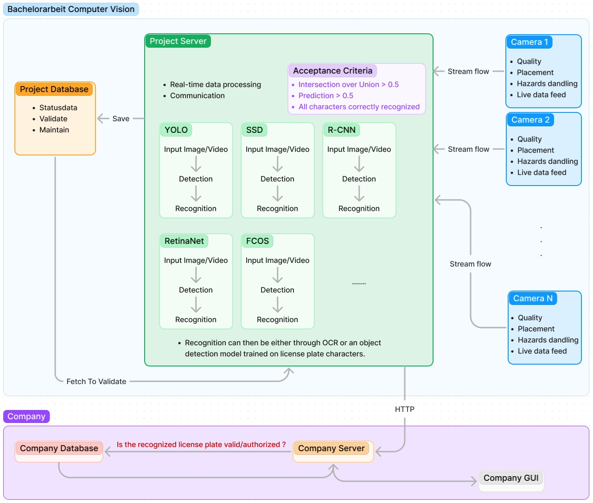
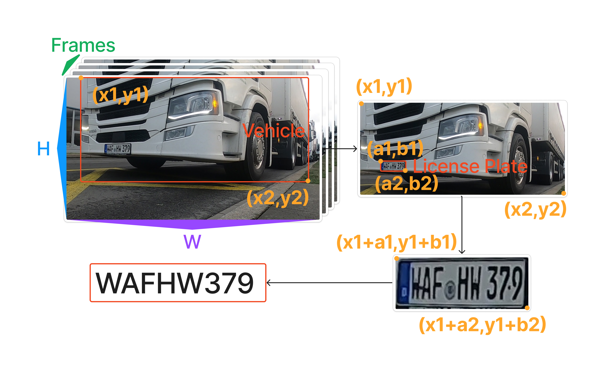

# License Plate Project

Link <a href="https://www.figma.com/file/lfJOlND64rLK5azyaCd4Jh/Bachelorarbeit-Computervision?type=whiteboard&node-id=0-1&t=FiaqyC9ke1vd8c8t-0" target="_blank">here</a>

# Pipeline

Link <a href="https://www.figma.com/board/PcARlDF4uVp4cVpFc5CEgE/Pipeline?node-id=0-1&t=Vh6HrgbkORjtOMnT-0" target="_blank">here</a>

# Setup
- Install `Anaconda` from <a href="https://www.anaconda.com/download" target="_blank">here</a>
- Open `JupyterLab` from `Anaconda Navigator` or from Terminal/Powershell using "jupyter lab" in the target directory.
- Download Models from <a href="https://drive.google.com/drive/folders/1pA-49Ci3gXO6-iylLxPuWhSAZMx5BANQ?usp=sharing" target="_blank">here</a>

# Index
- In `Literature` you can find research documents for referencing
- In `LicensePlateProject` is the source code and the actual progress of the project
- In `Resources` you can find ready made models and codes

# Definitions
- `Train/Test` is a method to measure the accuracy of the model.
- It is called `Train/Test` because the data is split into two sets: a `training set` and a `testing set`.
- 80% for `training`, and 20% for `testing`.
- The model is `trained` using the `training set`.
- The model is `tested` using the `test set`.
- To `train` the model means to `create` it.
- To `test` the model means finding out how `accurate` it is.
- `Detection` means finding something (e.g. vehicle, truck, car, license plate, human, ...)
- `Recognition` means trying to classify something with a percentage (e.g. possibly a truck or a car)
- `Identification` means finding a unique feature that defines a certain thing for sure (e.g. definitely a truck with that color and from a specific known company)

# Resources
- German License Plates Format <a href="https://www.customeuropeanplates.com/german-license-plate-codes" target="_blank">Source 1</a> <a href="https://www.skoda-storyboard.com/en/models/deciphering-number-plates-germany/" target="_blank">Source 2</a>
- Keras vs Tensorflow vs Pytorch <a href="https://www.simplilearn.com/keras-vs-tensorflow-vs-pytorch-article" target="_blank">here</a>
- Pytorch <a href="https://ai.meta.com/tools/pytorch/" target="_blank">here</a>
- Convolutional Neural Networks <a href="https://www.ibm.com/topics/convolutional-neural-networks" target="_blank">here</a>
- Recurrent Neural Networks <a href="https://www.ibm.com/topics/recurrent-neural-networks" target="_blank">here</a>
- CNN vs RNN <a href="https://www.techtarget.com/searchenterpriseai/feature/CNN-vs-RNN-How-they-differ-and-where-they-overlap" target="_blank">here</a>
- Intersection over Union <a href="https://pyimagesearch.com/2016/11/07/intersection-over-union-iou-for-object-detection/" target="_blank">here</a>
- MTCNN License Plate Variant Model Repo <a href="https://github.com/xuexingyu24/License_Plate_Detection_Pytorch?tab=readme-ov-file" target="_blank">here</a>
- Chinese City Parking Dataset Repo <a href="https://github.com/detectRecog/CCPD" target="_blank">here</a>
- LPRNet Pytorch Repo <a href="https://github.com/sirius-ai/LPRNet_Pytorch" target="_blank">here</a>
- Yolov8 Model <a href="https://mpolinowski.github.io/docs/IoT-and-Machine-Learning/ML/2023-09-15--yolo8-tracking-and-ocr/2023-09-15/" target="_blank">here</a>
- SORT for Realtime Multi-Object Tracking Repo <a href="https://github.com/abewley/sort" target="_blank">here</a>
- DeepSORT Repo <a href="https://github.com/nwojke/deep_sort" target="_blank">here</a>
- LocalMOT Repo <a href="https://github.com/google-research/localmot" target="_blank">here</a>

# Literature
- End-To-End License Plate Detection and Recognition <a href="https://openaccess.thecvf.com/content_ECCV_2018/papers/Zhenbo_Xu_Towards_End-to-End_License_ECCV_2018_paper.pdf" target="_blank">here</a>
- MTCNN Research <a href="https://arxiv.org/abs/1604.02878v1" target="_blank">Article</a> <a href="https://arxiv.org/ftp/arxiv/papers/1604/1604.02878.pdf" target="_blank">Document</a>
- Spatial Transformer Networks Research Site <a href="https://arxiv.org/abs/1506.02025" target="_blank">Article</a> <a href="https://arxiv.org/pdf/1506.02025.pdf" target="_blank">Document</a>
- LPRNet Research Site <a href="https://arxiv.org/abs/1806.10447" target="_blank">Article</a> <a href="https://arxiv.org/pdf/1806.10447.pdf" target="_blank">Document</a>
- SORT <a href="https://arxiv.org/abs/1602.00763" target="_blank">Article</a> <a href="https://arxiv.org/pdf/1602.00763.pdf" target="_blank">Document</a>
- LocalMOT <a href="https://arxiv.org/abs/2104.02631" target="_blank">Article</a> <a href="https://arxiv.org/pdf/2104.02631.pdf" target="_blank">Document</a>
- R-CNN <a href="https://arxiv.org/abs/1311.2524" target="_blank">Article</a> <a href="https://arxiv.org/abs/1311.2524.pdf" target="_blank">Document</a>
- Fast R-CNN <a href="https://arxiv.org/abs/1504.08083" target="_blank">Article</a> <a href="https://arxiv.org/abs/1504.08083.pdf" target="_blank">Document</a>
- Faster R-CNN <a href="https://arxiv.org/abs/1506.01497" target="_blank">Article</a> <a href="https://arxiv.org/pdf/1506.01497.pdf" target="_blank">Document</a>
- Mask R-CNN <a href="https://arxiv.org/abs/1703.06870" target="_blank">Article</a>
- SSD <a href="https://arxiv.org/abs/1512.02325" target="_blank">Article</a> <a href="https://arxiv.org/pdf/1512.02325.pdf" target="_blank">Document</a>
- YoloV7 <a href="https://arxiv.org/abs/2207.02696" target="_blank">Article</a> <a href="https://arxiv.org/abs/2207.02696.pdf" target="_blank">Document</a> <a href="https://github.com/WongKinYiu/yolov7" target="_blank">Repository</a>
- YoloV8 <a href="https://arxiv.org/abs/2305.09972" target="_blank">Article</a> <a href="https://arxiv.org/pdf/2305.09972" target="_blank">Document</a> <a href="https://github.com/ultralytics/ultralytics" target="_blank">Repository</a>
- YoloV9 <a href="https://arxiv.org/pdf/2402.13616" target="_blank">Article</a> <a href="https://arxiv.org/pdf/2402.13616.pdf" target="_blank">Document</a> <a href="https://github.com/WongKinYiu/yolov9" target="_blank">Repository</a>
- Yolov7 in action 
- DeepTextRecognition <a href="https://arxiv.org/abs/1904.01906" target="_blank">Article</a> <a href="https://arxiv.org/abs/1904.01906.pdf" target="_blank">Document</a> <a href="https://github.com/clovaai/deep-text-recognition-benchmark" target="_blank">Repository</a>
- CRNN <a href="https://arxiv.org/abs/1507.05717" target="_blank">Article</a> <a href="https://arxiv.org/abs/1507.05717.pdf" target="_blank">Document</a> <a href="https://github.com/bgshih/crnn#run-demo" target="_blank">Repository</a>
- RRPN++ <a href="https://arxiv.org/abs/2009.13118" target="_blank">Article</a> <a href="https://arxiv.org/abs/2009.13118.pdf" target="_blank">Document</a> <a href="https://github.com/mjq11302010044/RRPN_plusplus" target="_blank">Repository</a>
- TextBoxes++ <a href="https://arxiv.org/abs/1801.02765" target="_blank">Article</a> <a href="https://arxiv.org/abs/1801.02765.pdf" target="_blank">Document</a> <a href="https://github.com/MhLiao/TextBoxes_plusplus?tab=readme-ov-file#models" target="_blank">Repository</a>